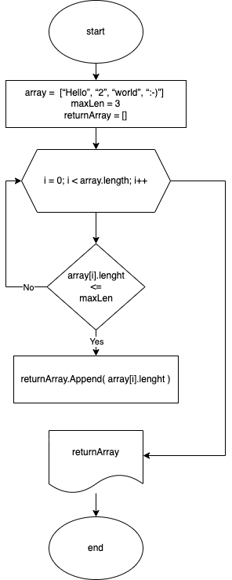

# Итоговая контрольная работа по основному блоку 

* [Задача](#task)
* [Блок-схема](#sheme)
* [Описание решения](#deskSolution)

## Задача

Написать программу, которая из имеющегося массива строк формирует новый массив из строк, длина которых меньше, либо равна 3 символам. Первоначальный массив можно ввести с клавиатуры, либо задать на старте выполнения алгоритма. При решении не рекомендуется пользоваться коллекциями, лучше обойтись исключительно массивами.

Пример вывода:
~~~
[“Hello”, “2”, “world”, “:-)”] → [“2”, “:-)”]
[“1234”, “1567”, “-2”, “computer science”] → [“-2”]
[“Russia”, “Denmark”, “Kazan”] → []
~~~

## Блок-схема решения

## Описание решения

Для решения задачи понадобится несколько функций
* [Функция проверки длины слова](#func1)
* [Функция добавления элемента в массив](#func2)
* [Функция возврата всех элементов с необходимой длинной](#func3)
* [Тело программы](#programmBody)

### Функция проверки длины слова

Функция на вход получает строковый элемент и максимальное колличество символов. Возвращает истину если число символов элемента больше или равно 2-ому аргументу функции (**maxLen**) 
~~~java
    bool CheckLenItem(string item, int maxLen) {
    return item.Count() <=  maxLen ? true : false;
}
~~~

### Функция добавления элемента в массив
Функция позволяет расширить массив на один элемент.
~~~java
string[] AppendItem(string[] array, string item) {
    
    if(array == null)
        return new string[] {item};
    
    int arrayLen = array.Length;
    string[] returnArray = new string[arrayLen + 1];
    for (int i = 0; i < arrayLen; i++)
    {
        returnArray[i] = array[i];
    }
    returnArray[arrayLen] = item;

    return returnArray;
}
~~~
### Функция возврата всех элементов с необходимой длинной

Это основная функция, которая возвращает массив с элементами длинна которых меньше или равна **maxLen** 
~~~java
string[] GetEl(string[] arr, int maxLen) {
    string[] retArr = new string[0];
    foreach (string item in arr)
    {
        if (CheckLenItem(item, maxLen))
        {
            retArr = AppendItem(retArr, item);
        }
    }
    return retArr;
    
}
~~~

### Тело программы

~~~java
string[] words = { "Russia", "Denmark", "Kazan" };
string[] newWords = GetEl(words, 3);
Console.WriteLine($"[\"{string.Join("\", \"", words)}\"] → [\"{string.Join("\", \"", newWords)}\"]");
// ["Russia", "Denmark", "Kazan"] → [""]
~~~